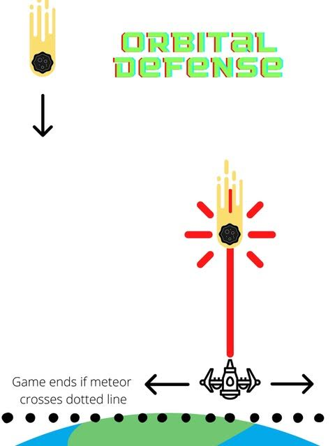

# Project-1-Videogame
Nicholas Bortz Project 1 Videogame

*** WELCOME TO ORBITAL DEFENSE! ***

The Earth is in danger and you are the only one who can save it!

A massive unknown object has barrelled into the moon, causing all manner of red hot debree to get caught in the Earth's gravitational pull. The pieces of debree have begun plumetting towards the Earth, threatening all life on its surface, as well as the structural integrity of the planet itself!

Most of Earth's defensive fleet was stationed at the Earth Federation Lunar Defense Base, which was completely annhialated by the impact! You are our only hope! Hop in your lone space fighter and blast the incoming debree to save the planet!

Orbital Defense is a retro-style top down shooter, where you must prevent the giant meteors from destroying both you, and the earth!

* INSTRUCTIONS *

You are the Earth's last line of defense

To START game, click the title button labeled "ORBITAL DEFENSE"

- Control your ship using the LEFT and RIGHT arrow keys

- Fire projectiles at incoming meteors with the SPACE bar

- You MUST destroy every single meteor plummeting towards the Earth, even a single collision with the planet spells doom for humanity due to the sheer mass of the objects that are on a collision course with earth, so shoot away!

- Unfortunately, your space fighter is NOT impregnable, if you are hit by any of the incoming debree your ship will be destroyed, so try to destroy the incoming objects before they reach you, or the planet!

Play Orbital Defense here!: 

https://apexbortz.github.io/Project-1-Videogame/

Project Goals

MVP
- Render game screen with stars & moving player
- Render randomly spawning meteors for player to destroy
- Make player able to fire projectiles
- Render earth below player to defend
- Write collision detection for meteors, projectiles, earth, & ship

Strecth Goals
- Add explosions effects
- Add score counter
- Sound Effects
- Upload sprites for ship & meteors & earth